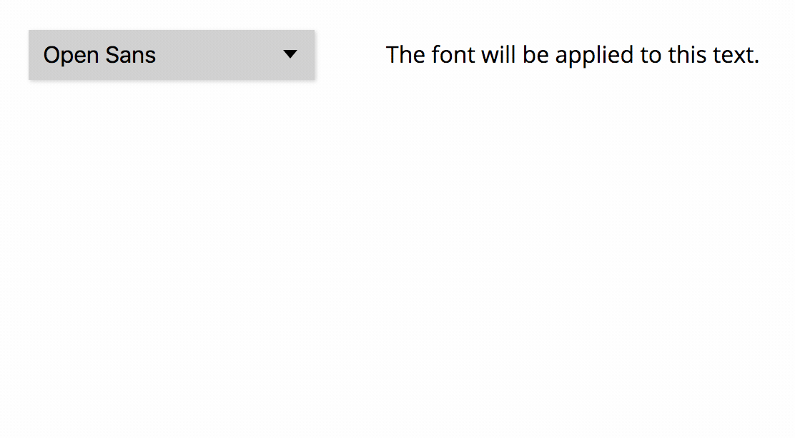
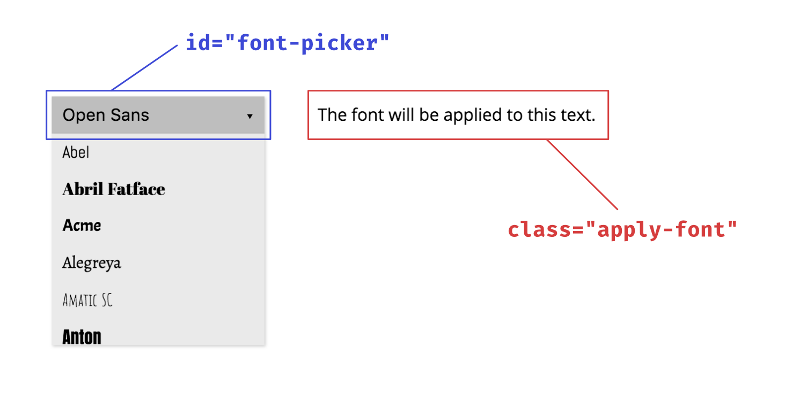

# Font Picker

**A simple, customizable font picker allowing users to preview, select, and use Google Fonts on your website.**

* Simple setup
* Automatic font download and generation of the required CSS styles
* Efficient font previews (previews are loaded dynamically and full fonts are only downloaded on selection)

→ **[Demo](https://samuelmeuli.github.io/font-picker)**

_If you use React, see [**Font Picker for React**](https://github.com/samuelmeuli/font-picker-react)._

<p align="center">
  
</p>


## Getting started

### 1. Setup

You have the following options for installing/using the package:

* **Download using script tags:** Download the `font-picker.js` file from the [releases page](https://github.com/samuelmeuli/font-picker/releases/latest), add it to your project, and include it in your HTML:

```html
<script type="text/javascript" src="path/to/font-picker.js"></script>
<script type="text/javascript">
  const fontPicker = new FontPicker(
    'YOUR_API_KEY', // Google API key
    'Open Sans', // default font
    { limit: 50 } // additional options
  );
</script>
```

* **Using CDN:** You can load the package from a CDN like unpkg:

```html
<script type="text/javascript" src="https://unpkg.com/font-picker^@2"></script>
<script type="text/javascript">
  const fontPicker = new FontPicker(
    'YOUR_API_KEY', // Google API key
    'Open Sans', // default font
    { limit: 50 } // additional options
  );
</script>
```

* **Using NPM:** If you're using a module bundler like Webpack, you can install the `font-picker` package from NPM and import it in your code:

```sh
npm install font-picker
```

```js
import { FontPicker } from 'font-picker';

const fontPicker = new FontPicker(
  'YOUR_API_KEY', // Google API key
  'Open Sans', // default font
  { limit: 50 } // additional options
);
```


### 2. Displaying the font picker

**Create an empty `<div>` with the ID `"font-picker"`** in your HTML file. This is where the font picker will be generated.

```html
<div id="font-picker"></div>
```


### 3. Applying the selected font

**Add the class `"apply-font"` to all HTML elements you want to apply the selected font to.**

When the user selects a font, it will automatically be downloaded and applied to all HTML elements of the `"apply-font"` class.

<p align="center">
  
</p>


## Example

See [`demo/index.html`](demo/index.html) for an example.


## Customization

### Parameters

The following parameters can be passed to the constructor of the `FontPicker` class:

```js
const fontPicker = new FontPicker(apiKey, defaultFont, options, onChange);
```

* **`apiKey` (required)**: Google API key (can be generated [here](https://developers.google.com/fonts/docs/developer_api#APIKey))
* **`defaultFont`**: Font that is selected on initialization (default: `'Open Sans'`)
* **`options`**: Object with additional optional parameters:
  * **`name`**: If you have multiple font pickers on your site, you need to give them unique names (which may only consist of letters and digits). These names must also be appended to the font picker's ID and the `.apply-font` class name. Example: If `options = { name: 'main' }`, use `#font-picker-main` and `.apply-font-main`
  * **`families`**: If only specific fonts shall appear in the list, specify their names in an array (default: all font families)
  * **`categories`**: Array of font categories – possible values: `'sans-serif', 'serif', 'display', handwriting', 'monospace'` (default: all categories)
  * **`variants`**: Array of variants which the fonts must include and which will be downloaded; the first variant in the array will become the default variant and will be used in the font picker and the `.apply-font` class. Example: `['regular', 'italic', '700', '700italic']` (default: `['regular']`)
  * **`limit`**: Maximum number of fonts to be displayed in the list (the least popular fonts will be omitted; default: `100`)
  * **`sort`**: Sorting attribute for the font list – possible values: `'alphabetical'` (default), `'popularity'`
* **`onChange`**: Function which is executed when the user changes the active font and its stylesheet has finished downloading


### Functions

The `FontPicker` class has the following functions:

* **`getActiveFont()`**: Returns an object with information about the currently selected font
* **`setActiveFont(fontFamily)`**: Change the active font programmatically


## Development

To build the project locally, do the following:

* `git clone`
* `yarn install`
* `yarn start` to generate the library bundle using [Rollup](https://github.com/rollup/rollup) and serve the demo website on `localhost:3000`

Suggestions and contributions are always welcome! Please first discuss changes via issue before submitting a pull request.
